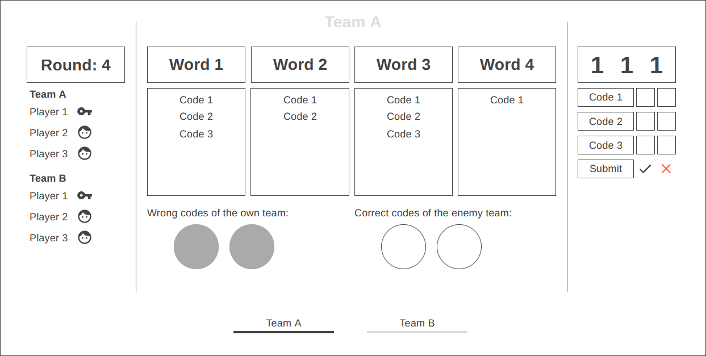

# codebreaker-game
Decrypto-like multiplayer online browser game

It uses [Vue.js](https://vuejs.org/) for reactive pages.

The current page can be seen here: https://loomie.github.io/codebreaker-game/

Later it may look roughly like this:

## Glossary

Code
: Three numbers that denote the position of a _keyword_ for which a _hint_ must be given. For example 312 means the first _hint_ must relate to the third _keyword_, second _hint_ is for the first _keyword_ and last _hint_ is for the second _keyword_.

Encoder
: The player who gives _hints_ in the current _round_.

Guess
: One number of the _code_. One _guess_ is given for each _hint_ to reconstruct the _code_ used by the _encoder_.

Hint
: A related word for a specific _keyword_. It describes/encodes one _keyword_ so the own team can _guess_ it but hopefully the other team can not.

Keyword
: One of the four fixed words for which _hints_ must be given to _guess_ them.

Round
: The game is played in multiple _rounds_. Each _round_ consists of multiple steps that are went through: A _code_ is generated for each team, _Encoder_ gives _hints_ for that _code_ to her team, each team _guesses_ the _code_ based on the _hints_ for both teams, the original _code_ is revealed and compared to the _guesses_ and finally the result is checked if the game ends or continues with the next _round_.
